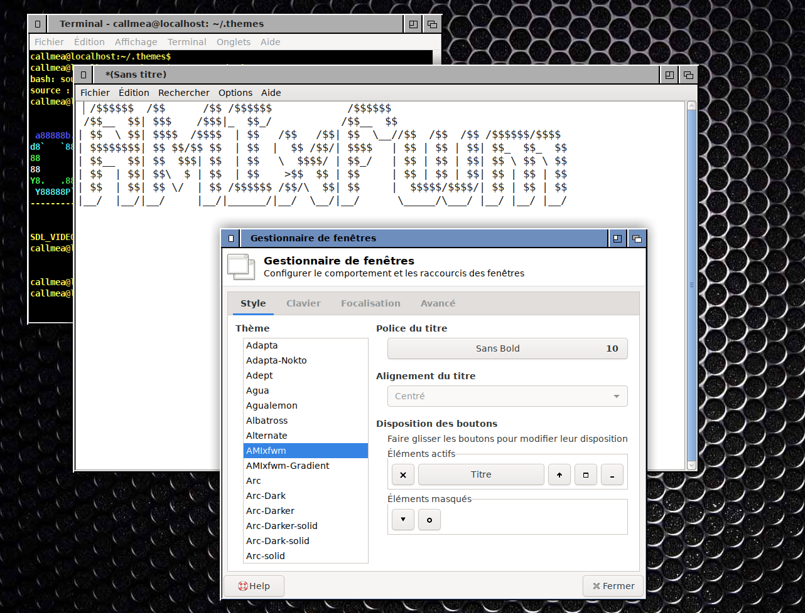

# Back to the past (or to the future)!  ;-) 

Do you want some fun with XFCE or are you nostalgic of the nineties?

Try this theme! 

It's inspired by a famous 90's computer OS and especially designed to use on HD display.

It isn't a real copy, I made it from scratch for fun and I needed to make some minor changes / improvements in order to works with xfwm.

There are two flavours of this theme :

### AMIxfwm 

Standard, with the classic colors of 2.0/3.0 original OS

### AMIxfwm-Gradient

The same with a light gradient, looks better and more modern. 

## Preview

## How to install it?

- Extract the archive and copy its content to your $USER/.themes directory (or /usr/share/themes if you prefer). 
- If you want to have the close button on the left, open the windows manager settings, choose the theme and move the close button on the left.
- Enjoy :)

## About & License
(C) 2023 "Thomas Missonier 2020 (https://github.com/sourcezax)
License GPL V3(See)[http://www.gnu.org/licenses/gpl.html].
